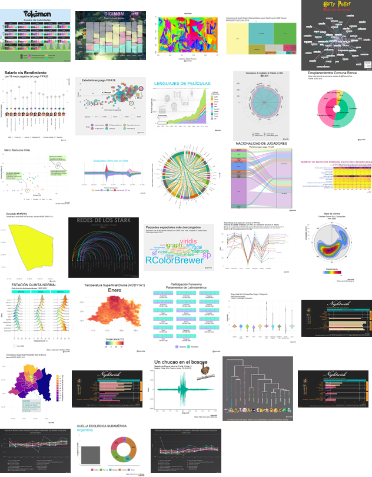

```{r xaringan-themer, include=FALSE, warning=FALSE}
library(xaringanthemer)
style_duo(primary_color = "#309c94", secondary_color = "#FFFFFF",
  header_font_google = google_font("Orbitron", "400"),
  text_font_google   = google_font("Work Sans", "300", "300i"),
  code_font_google   = google_font("IBM Plex Mono"),
  text_bold_color = "#d95f9a",
  link_color = "#a495ed"
)
```

# Desafíos de 30 días

.pull-left[

```{r,  echo = F, fig.align='center'}
#nightingale
knitr::include_graphics("https://pbs.twimg.com/media/EYdwP6AUEAQrvv1?format=jpg&name=medium")
```

```{r, out.width="50%", out.height="50%", echo = F, fig.align='center'}
#genuary
knitr::include_graphics("https://pbs.twimg.com/media/Eo9iUL5XcAImG_S.jpg")
```


]

.pull-right[

```{r, out.width="50%", out.height="50%", echo = F, fig.align='center'}
#book
knitr::include_graphics("https://company.overdrive.com/wp-content/uploads/2018/11/30_day_book_updated.jpg")
```

```{r, echo = F, fig.align='center'}
# map
knitr::include_graphics("https://www.gislounge.com/wp-content/uploads/2020/10/30-day-map-challenge-november-2020.jpeg")
```
]

---
class: inverse
# 30 días de gráficos

.pull-left[

- Organizado por la comunidad de R en español `r emo::ji('ok_hand')`

- Entre mayo y junio 2020 `r emo::ji('calendar')`

- Cada día un tipo de gráfico diferente según la consigna `r emo::ji('bar_chart')`

- Desafío personal: **Tidyverse**

- Aprendí mucho y fue muy divertido `r emo::ji('nerd_face')`

- Pero dije: ¡Nunca más! `r emo::ji('tired_face')`
]

.pull-right[

```{r, echo=F, message=F, warning=F, out.width="80%", fig.align='right'}

```

]

---
class: inverse
# 30 días de mapas

.pull-left[

- Organizado por [Topi Tjukanov](https://github.com/tjukanovt) `r emo::ji('ok_hand')`

- En noviembre de 2020 `r emo::ji('calendar')`

- Cada día un mapa diferente según la consigna `r emo::ji('earth')`

- Desafío personal: **Mapas con código**

- Aprendí mucho y fue muy divertido `r emo::ji('nerd_face')`

- Pero dije: Ahora voy a escribir un post con consejos para abordar este tipo de desafíos `r emo::ji('light_bulb')`

`r emo::ji('pushpin')`[Puedes encontrarlo aquí](https://sporella.netlify.app/2020/12/01/30daymap/)

]

.pull-right[

```{r, echo=F, message=F, warning=F, out.width="80%", fig.align='right'}
knitr::include_graphics("https://raw.githubusercontent.com/sporella/30daymap/master/plots/0_collage.png")
```

]

---
# Por qué participar

- Aprendes mucho

- Se genera una comunidad en torno al desafío y aprendes de lo que hacen los demás

- Ganas seguidores `r emo::ji('thumbs_up')`

- Experiencia creativa

- Estudio intensivo. Dedicarle una hora (o mucho más) cada día a un tema te permite avanzar mucho!

- Conoces nuevos paquetes y variadas fuentes de información.

---
# Consejos

- Planifica

- Si no puedes hacer los 30 días, has lo que puedas.

- Puedes reutilizar `r emo::ji('recycle')`

- No todo tiene que ser perfecto

- Busca inspiración mirando lo que hacen los demás `r emo::ji('eyes')`

- Usar el hashtag del desafío y de las herramientas que utilizas, como `#rstats`, `#rspatial` o `#rayshader` esto hará que puedas recibir más interacciones.

---
class: inverse

# Recursos

**Si te interesan los mapas y la visualización de datos ¡anímate a participar el siguiente año!**


- [Listado de todos los mapas hechos con R](https://github.com/Nowosad/rspatial-map-challenge-2020) durante #30daymapchallenge

- [Galería con todas las contribuciones](https://david.frigge.nz/30DayMapChallenge2020/maps.html) de #30daymapchallenge

- [Mi repositorio de 30 días de mapas 2020](https://github.com/sporella/30daymap): acá están todos los mapas que hice durante el desafío de 30 días de mapas.

- [Mi repositorio de 30 días de gráficos 2020](https://github.com/sporella/nightingale): acá están todos los mapas que hice durante el desafío #30daymapchallenge

- [Taller de datos espaciales RLadiesChile](https://github.com/sporella/datos_espaciales_tutorial): taller introductorio sobre datos espaciales

---
class: center, middle
# 60 días con R
## `r paste(emo::ji('microbe'), emo::ji('face_with_medical_mask'), emo::ji('woman_technologist'))`
